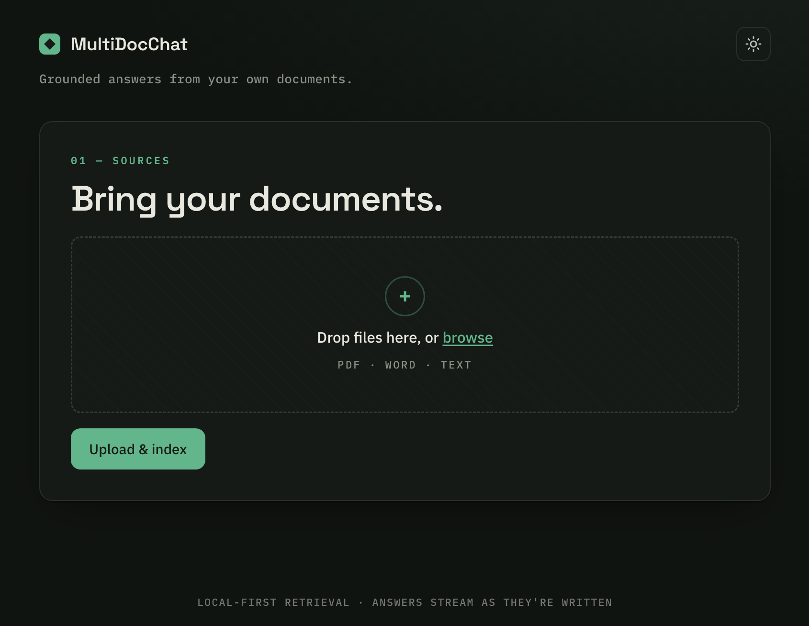

# MultiDocChat — RAG with an LLMOps toolkit

### ▶ [Live demo →](https://multidocchat.onrender.com/)



*Hosted free on Render — the instance sleeps when idle, so the first load may take ~30s to wake. Upload a PDF/Word/text file, then ask it questions.*

A multi-document, conversational **Retrieval-Augmented Generation (RAG)** application built
to demonstrate production concerns, not just a demo: automated quality evaluation gated in
CI, token streaming, hybrid retrieval with reranking, and an optional agentic
self-correcting retrieval engine — all behind a clean FastAPI service.

Upload documents, then chat with them. Answers are grounded in the retrieved content, the
conversation is history-aware, and the whole pipeline is measurable, configurable, and
swappable.

---

## Highlights

| Capability | What it does |
|---|---|
| **Eval-gated quality** | An LLM-as-judge harness scores answers (correctness, faithfulness, answer-relevancy, context precision/recall) against a golden dataset and **fails CI if quality regresses** below thresholds. |
| **Token streaming (SSE)** | Answers stream token-by-token over Server-Sent Events, cutting time-to-first-token from **~1.5s to ~0.5s** versus the blocking endpoint. |
| **Hybrid retrieval + reranking** | BM25 (lexical) fused with dense vector search, then re-scored by a cross-encoder reranker — all toggleable from config. |
| **Agentic corrective-RAG** | An optional LangGraph engine that grades retrieved documents, rewrites the query and retries when retrieval is weak, and checks its own answer for grounding before returning it. |
| **Provider-flexible & local-first** | Embeddings run **on-device** (fastembed/onnx, no GPU); the LLM is pluggable (Groq or Google) via config. |
| **Operable** | Structured JSON logging, per-request latency/TTFT metrics, a bounded per-session model cache, and a pluggable session store (in-memory or Redis for multi-worker). |

---

## Architecture

Two phases — **indexing** (on upload) and **querying** (on chat):

```
INDEXING (POST /upload)
  files → save → load (pdf/docx/txt) → split into chunks
        → embed (fastembed, local) → FAISS index on disk
        → persist chunks.jsonl (for BM25)

QUERYING (POST /chat or /chat/stream)
  question + history
     → contextualize into a standalone question
     → retrieve  ── dense (FAISS/MMR) ┐
                    sparse (BM25)      ├─ fuse → rerank (cross-encoder) → top-k chunks
     → stuff chunks into prompt → LLM → grounded answer (streamed)
```

The **retrieval strategy is config-driven**: plain dense, hybrid, or hybrid+rerank. An
optional **corrective-RAG** engine wraps the same retriever in a LangGraph state machine
that self-corrects before answering.

### Core components

| Module | Responsibility |
|---|---|
| `main.py` | FastAPI service: `/upload`, `/chat`, `/chat/stream`, `/health`, UI |
| `multi_doc_chat/src/document_ingestion/data_ingestion.py` | Loading, chunking, embedding, FAISS index, idempotent writes |
| `multi_doc_chat/src/document_chat/retrieval.py` | `ConversationalRAG` — LCEL chain (history-aware rewrite → retrieve → answer), streaming |
| `multi_doc_chat/src/document_chat/hybrid_retrieval.py` | BM25+dense ensemble and cross-encoder reranker |
| `multi_doc_chat/src/document_chat/agentic_rag.py` | `CorrectiveRAG` — LangGraph corrective loop |
| `multi_doc_chat/utils/` | Model loader, config loader, session store, file IO |
| `eval/` | Golden dataset, metrics, gating runner, report diff |

---

## Tech stack

- **API:** FastAPI + Uvicorn
- **Orchestration:** LangChain (LCEL) and LangGraph
- **Embeddings:** fastembed (onnx, local) — default `BAAI/bge-small-en-v1.5`
- **Vector store:** FAISS
- **Retrieval:** BM25 (`rank-bm25`) + dense ensemble, cross-encoder reranker (fastembed `TextCrossEncoder`)
- **LLM:** Groq (`openai/gpt-oss-20b`) or Google (`gemini-2.5-flash`), provider-selectable
- **Session state:** in-memory or Redis
- **Tooling:** `uv`, `pytest`, structlog, Docker, Jenkins

---

## Getting started

### Prerequisites
- Python **3.12**
- [`uv`](https://docs.astral.sh/uv/) for dependency management
- A **Groq API key** (free tier works) — get one at <https://console.groq.com/keys>

### Install
```bash
uv sync
```

### Configure
Create a `.env` in the project root:
```bash
# LLM (default provider is groq)
GROQ_API_KEY="gsk_..."
LLM_PROVIDER="groq"          # "groq" | "google"

# Only needed if you switch embeddings or the LLM to Google
# GOOGLE_API_KEY="..."

CONFIG_PATH="config/config.yaml"
```
Embeddings run locally by default (no key required).

### Run
```bash
uv run python main.py        # serves on http://localhost:8000
```
Open <http://localhost:8000>, upload a document, and start chatting. The first run
downloads the local embedding/reranker models once.

---

## Usage

### Web UI
Drag-and-drop files to index them, then ask questions. Answers stream in token-by-token.

### API
| Endpoint | Method | Body | Returns |
|---|---|---|---|
| `/upload` | POST | multipart `files` | `{ session_id, indexed }` |
| `/chat` | POST | `{ session_id, message }` | `{ answer }` (blocking) |
| `/chat/stream` | POST | `{ session_id, message }` | SSE stream of `{ token }` then `{ done }` |
| `/health` | GET | — | `{ status }` |

```bash
# upload
SID=$(curl -s -F "files=@eval/corpus/ai_engineering_report.txt" \
  http://localhost:8000/upload | python -c "import sys,json;print(json.load(sys.stdin)['session_id'])")

# stream an answer
curl -N -X POST http://localhost:8000/chat/stream \
  -H 'Content-Type: application/json' \
  -d "{\"session_id\":\"$SID\",\"message\":\"What is RAG?\"}"
```

---

## Configuration

Everything below is set in `multi_doc_chat/config/config.yaml`:

```yaml
embedding_model:
  provider: "fastembed"               # local onnx — no API key
  model_name: "BAAI/bge-small-en-v1.5"

llm:
  groq:   { provider: "groq",   model_name: "openai/gpt-oss-20b", temperature: 0 }
  google: { provider: "google", model_name: "gemini-2.5-flash",   temperature: 0 }

hybrid:                                # BM25 + dense fusion
  enabled: true
  dense_weight: 0.5
  sparse_weight: 0.5
  fetch_k: 20

reranker:                             # cross-encoder re-scoring
  enabled: true
  model_name: "Xenova/ms-marco-MiniLM-L-6-v2"
  top_n: 5

rag:
  engine: "standard"                  # "standard" | "corrective" (agentic CRAG)
  max_retries: 2
```

- Flip `hybrid.enabled` / `reranker.enabled` to A/B retrieval strategies.
- Set `rag.engine: "corrective"` to use the self-correcting agentic engine.
- Switch the LLM with the `LLM_PROVIDER` env var.

---

## Evaluation

A self-contained, **dependency-free LLM-as-judge** harness measures answer quality and can
gate a build.

```bash
python eval/run_eval.py                 # scores against eval/golden_dataset.jsonl,
                                        # exits non-zero if any metric < its threshold
python eval/run_eval.py --report-only   # never fails the build; just writes the report
```

- **Metrics:** correctness, faithfulness, answer-relevancy, context-precision, context-recall.
- **Dataset:** `eval/golden_dataset.jsonl` (question/reference pairs) against a fixed corpus
  in `eval/corpus/`.
- **Thresholds:** `eval/thresholds.yaml` — the quality gate.
- **Compare runs:** `python eval/compare_reports.py <baseline.json> <current.json>` prints a
  per-metric delta (used to A/B retrieval configurations).

The Jenkins pipeline (`Jenkinsfile.test`) runs the test suite and the eval gate.

---

## Performance

Measure streaming time-to-first-token vs. the blocking endpoint:
```bash
./scripts/measure_ttft.sh               # app must be running
```
On a typical run, streaming delivers the first token in **~0.5s** vs. **~1.5s** for the full
blocking response — answers begin rendering immediately.

---

## Testing

```bash
uv run pytest -q
```
Unit and integration tests cover ingestion, retrieval, the session store, the LRU model
cache, the chat routes, and SSE streaming.

---

## Deployment

```bash
docker build -t multidocchat .
docker run -p 8080:8080 --env-file .env multidocchat
```

The app is **single-worker by default**: session history and the per-session model cache are
in-process. To scale horizontally, set `REDIS_URL` so session state is shared across workers,
ensure the FAISS index directory is on shared storage, then run multiple Uvicorn workers.

---

## Notes & limitations

- The default corpus is small; hybrid+reranking and agentic CRAG show the clearest gains on
  larger, noisier document sets. The evaluation harness is included precisely so retrieval
  changes can be measured honestly rather than assumed.
- The corrective (agentic) engine makes several LLM calls per question; keep it off by
  default and enable it per-use.
- In-memory session state is intended for single-worker use; use the Redis store for
  multi-worker deployments.

---

## Project layout

```
main.py                     # FastAPI app
multi_doc_chat/             # core package
  src/document_ingestion/   # load → split → embed → index
  src/document_chat/        # ConversationalRAG, hybrid retrieval, agentic CRAG
  utils/                    # model/config loaders, session store, file IO
  config/config.yaml        # central configuration
  prompts/ model/ logger/ exceptions/
eval/                       # golden dataset, metrics, gating runner, report diff
templates/ static/          # web UI
tests/                      # unit + integration tests
scripts/                    # TTFT measurement
docs/                       # implementation guides for each feature
Dockerfile  Jenkinsfile.test
```
